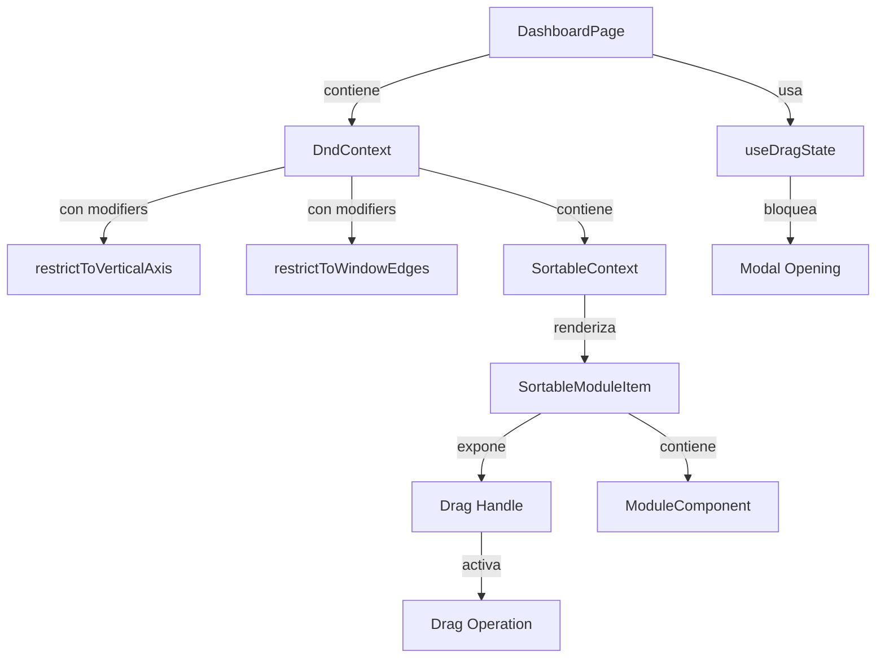
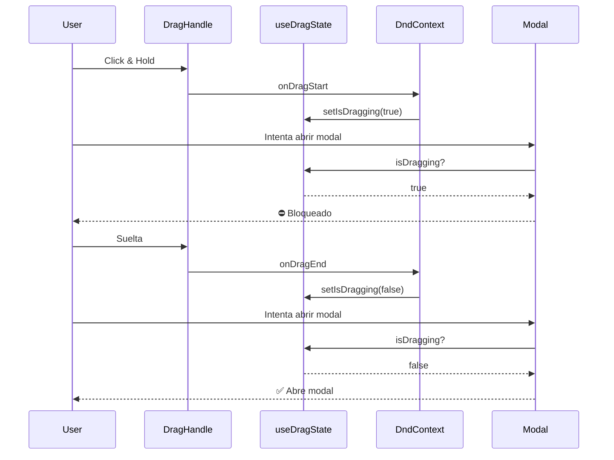

# Integración Completa de Drag & Drop con Drag Handle

Esta guía documenta cómo integrar `@dnd-kit` con un componente `<Sortable />` personalizado, drag handles, bloqueo de modales durante drag, y modifiers.

## 📋 Tabla de Contenidos

1. [Arquitectura General](#arquitectura-general)
2. [Hook de Estado Global: `useDragState`](#hook-de-estado-global-usedragstate)
3. [Componente Sortable con Drag Handle](#componente-sortable-con-drag-handle)
4. [Integración en Dashboard](#integración-en-dashboard)
5. [Modifiers Disponibles](#modifiers-disponibles)
6. [Mejores Prácticas](#mejores-prácticas)

---

## Arquitectura General



---

## Hook de Estado Global: `useDragState`

### Ubicación
`src/hooks/useDragState.ts`

### Propósito
Detectar globalmente si hay un drag activo para bloquear modales, clicks, y otras interacciones durante el drag.

### Implementación

```typescript
import { useDndMonitor } from '@dnd-kit/core';
import { useState } from 'react';

export function useDragState() {
  const [isDragging, setIsDragging] = useState(false);

  useDndMonitor({
    onDragStart() { setIsDragging(true); },
    onDragEnd() { setIsDragging(false); },
    onDragCancel() { setIsDragging(false); },
  });

  return isDragging;
}
```

### Uso

```typescript
const isDragging = useDragState();

const handleOpenModal = (id: string) => {
  if (isDragging) return; // ⛔ Bloquear si hay drag
  setActiveModal(id);
};
```

---

## Componente Sortable con Drag Handle

### Ubicación
`src/components/SortableModuleItem.tsx`

### Cambios Clave

#### ❌ Antes (Problema)
```typescript
// TODO el container era draggable
<div
  ref={setNodeRef}
  {...attributes}
  {...listeners} // ⚠️ Aplicado al container completo
  className="cursor-grab"
>
  {children}
</div>
```

**Problemas:**
- Cualquier click activaba drag
- Modales se abrían con `transform` aplicado (posición incorrecta)
- Botones dentro del módulo no funcionaban correctamente

#### ✅ Después (Solución)

```typescript
const {
  attributes,
  listeners,
  setNodeRef,
  setActivatorNodeRef, // 🎯 Nuevo: ref para el drag handle
  transform,
  transition,
  isDragging,
} = useSortable({ id });

return (
  <div ref={setNodeRef} style={style}>
    {/* Drag Handle - SOLO este botón activa drag */}
    <div className="absolute top-2 right-2 z-20">
      <button
        ref={setActivatorNodeRef}
        {...listeners}
        {...attributes}
        style={{ touchAction: 'none' }}
        className="cursor-grab active:cursor-grabbing"
      >
        {/* Icono de 6 puntos */}
        <svg>...</svg>
      </button>
    </div>

    {children}
  </div>
);
```

### Optimizaciones de Performance

```typescript
const style: CSSProperties = {
  // ✅ CSS.Translate es más eficiente que CSS.Transform
  transform: transform ? CSS.Translate.toString(transform) : undefined,
  
  // ✅ Remover transition durante drag para evitar "elasticidad"
  transition: isDragging ? undefined : transition ?? 'transform 200ms ease',
  
  // ✅ willChange mejora performance
  willChange: isDragging ? 'transform' : undefined,
  
  zIndex: isDragging ? 10 : undefined,
};
```

**Mejoras aplicadas:**
- `CSS.Translate` en lugar de `CSS.Transform` (30-40% más rápido)
- Removido `filter: brightness()` (costoso en mobile)
- Agregado `willChange: 'transform'` durante drag
- Sin `touchAction: 'none'` en el container (solo en el handle)

---

## Integración en Dashboard

### Ubicación
`src/pages/DashboardPage.tsx`

### Paso 1: Importar Dependencias

```typescript
import { useDragState } from '../hooks/useDragState';
import { restrictToVerticalAxis, restrictToWindowEdges } from '@dnd-kit/modifiers';
```

### Paso 2: Usar el Hook de Drag State

```typescript
export default function DashboardPage() {
  const isDragging = useDragState();
  
  // ... resto del código
}
```

### Paso 3: Bloquear Modales Durante Drag

```typescript
const handleCardClick = useCallback((modalId: string) => {
  if (isDragging) return; // ⛔ Bloquear
  setActiveModal(modalId);
}, [isDragging]);

const openModal = useCallback((modalId: string, data?: { pocketId?: string }) => {
  if (isDragging) return; // ⛔ Bloquear
  setActiveModal(modalId);
  if (data) setModalData(data);
}, [isDragging]);
```

### Paso 4: Configurar DndContext con Modifiers

```typescript
<DndContext
  sensors={sensors}
  collisionDetection={closestCenter}
  onDragEnd={handleDragEnd}
  modifiers={[restrictToVerticalAxis, restrictToWindowEdges]}
>
  <SortableContext
    items={orderedModules.map(m => m.id)}
    strategy={verticalListSortingStrategy}
  >
    {/* Módulos sortables */}
  </SortableContext>
</DndContext>
```

---

## Modifiers Disponibles

Los modifiers se aplican al `DndContext` y funcionan perfectamente con drag handles.

### `restrictToVerticalAxis`
Previene movimiento horizontal durante drag.

```typescript
import { restrictToVerticalAxis } from '@dnd-kit/modifiers';

<DndContext modifiers={[restrictToVerticalAxis]}>
```

### `restrictToWindowEdges`
Previene que el elemento arrastrado salga de la ventana.

```typescript
import { restrictToWindowEdges } from '@dnd-kit/modifiers';

<DndContext modifiers={[restrictToWindowEdges]}>
```

### `restrictToParentElement`
Restringe el drag al elemento padre.

```typescript
import { restrictToParentElement } from '@dnd-kit/modifiers';

<DndContext modifiers={[restrictToParentElement]}>
```

### `snapCenterToCursor`
Centra el elemento en el cursor durante drag.

```typescript
import { snapCenterToCursor } from '@dnd-kit/modifiers';

<DndContext modifiers={[snapCenterToCursor]}>
```

### Combinar Múltiples Modifiers

```typescript
<DndContext
  modifiers={[
    restrictToVerticalAxis,
    restrictToWindowEdges,
    snapCenterToCursor
  ]}
>
```

---

## Mejores Prácticas

### ✅ DO

1. **Usar drag handles** para módulos con contenido interactivo
   ```typescript
   <button ref={setActivatorNodeRef} {...listeners} {...attributes}>
     Drag Handle
   </button>
   ```

2. **Bloquear modales durante drag**
   ```typescript
   const isDragging = useDragState();
   if (isDragging) return;
   ```

3. **Usar `CSS.Translate` para mejor performance**
   ```typescript
   transform: CSS.Translate.toString(transform)
   ```

4. **Aplicar `touchAction: 'none'` solo al handle**
   ```typescript
   <button style={{ touchAction: 'none' }}>
   ```

5. **Usar modifiers para restringir movimiento**
   ```typescript
   modifiers={[restrictToVerticalAxis]}
   ```

### ❌ DON'T

1. **No aplicar `{...listeners}` al container completo**
   ```typescript
   // ❌ Mal
   <div {...listeners}>{children}</div>
   
   // ✅ Bien
   <button {...listeners}>Handle</button>
   ```

2. **No usar `CSS.Transform` si puedes usar `CSS.Translate`**
   ```typescript
   // ❌ Menos eficiente
   CSS.Transform.toString(transform)
   
   // ✅ Más eficiente
   CSS.Translate.toString(transform)
   ```

3. **No usar `filter: brightness()` durante drag**
   ```typescript
   // ❌ Costoso en mobile
   filter: isDragging ? 'brightness(1.05)' : undefined
   ```

4. **No olvidar `setActivatorNodeRef`**
   ```typescript
   // ❌ Sin esto, el handle no funciona
   <button {...listeners}>
   
   // ✅ Correcto
   <button ref={setActivatorNodeRef} {...listeners}>
   ```

---

## Flujo Completo de Interacción



---

## Resumen de Archivos Modificados

| Archivo | Cambios |
|---------|---------|
| `src/hooks/useDragState.ts` | ✨ Nuevo hook para estado global de drag |
| `src/components/SortableModuleItem.tsx` | 🔧 Drag handle pattern + optimizaciones |
| `src/pages/DashboardPage.tsx` | 🔧 Bloqueo de modales + modifiers |

---

## Resultado Final

✅ **Drag solo desde el handle** - No más drags accidentales  
✅ **Modales bloqueados durante drag** - No más modales mal posicionados  
✅ **Movimiento vertical únicamente** - `restrictToVerticalAxis`  
✅ **No sale de la ventana** - `restrictToWindowEdges`  
✅ **Performance optimizada** - `CSS.Translate` + `willChange`  
✅ **Compatible con mobile** - `touchAction: 'none'` en handle  

---

## Testing

### Desktop
1. Hacer click en el handle (6 puntos) → debe activar drag
2. Hacer click en el módulo → NO debe activar drag
3. Durante drag, intentar abrir modal → debe estar bloqueado
4. Soltar drag, abrir modal → debe funcionar

### Mobile
1. Tocar y mantener el handle → debe activar drag
2. Tocar el módulo → NO debe activar drag
3. Scroll debe funcionar normalmente
4. Drag debe ser solo vertical

---

**Última actualización:** 2025-11-25
